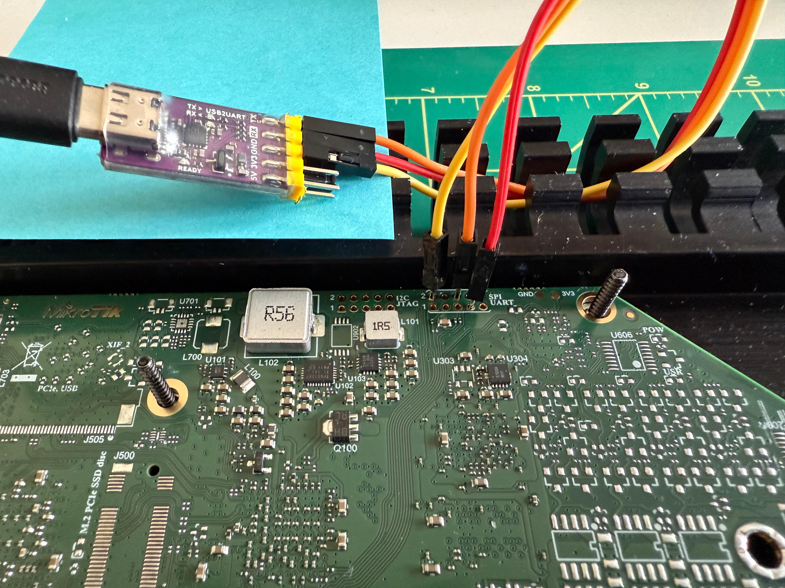

# MikroTik RB5009UG+S+IN Bootloader Unbrick

A guide to unbrick your RB5009 if it suffers from a broken ATF (ARM Trusted
Firmware) and/or Backup Bootloader.

## Why

Around the first week of May 2025, MikroTik distributed a backup bootloader
upgrade on their support Wiki which supposedly was "universal" and for all
platforms. Unfortunately, when applied on the RB5009 it erases the ATF and
Backup Bootloader and renders the device unbootable and unrecoverable via
Netinstall.

See
[the MikroTik Forum discussion topic](https://forum.mikrotik.com/viewtopic.php?t=216738).

## Disclaimer

I am in no way responsible if you further break your RB5009 by attempting this
repair.

> Kurš MikroTik baidās, tas mājās sedi.  
> — _Latvian Proverb_

## How

Here's how you can bring your RB5009 back to life.

### Prerequisites

You will need:

1. A computer running Linux.

1. A USB to TTL adapter.

   I use the
   [WeAct Studio CH343P module](https://www.aliexpress.com/item/1005004399796277.html)
   but it doesn't matter which specific module you use as long as it supports
   and is set to 3.3V logic levels.

1. A USB flash drive, 1GB or larger, formatted with a single FAT or ext4
   partition

1. Thermal paste (optional)

   If you plan on removing the board from the aluminium heatsink it is
   recommended to replace the thermal paste on SoC and switch chip before
   reassembling the device.

### Preparation

1. Download a
   [ZIP file of this repository](https://github.com/kaechele/rb5009-unbrick/archive/refs/heads/main.zip)
   to your computer and extract it.

1. Format the USB flash drive with a single partition using the ext4 or FAT
   filesystem.

1. Copy the `openwrt-mvebu-cortexa72-mikrotik_rb5009-initramfs-uImage.itb` file
   from this repository to the root folder of the USB flash drive. Put aside.

1. Open your RB5009 by removing the screws on the bottom of the router.

   Don't forget to remove the green pluggable terminal connector on the left
   side of the router before removing the plastic top cover, otherwise the cover
   will not lift off.

   Lift the cover by pulling it forwards and upwards from the front, where the
   ethernet ports are.

1. Find the UART header on the board. It is located at the top right corner.

1. Connect wires from your USB to TTL adapter to the approrpiate connectors.
   Here is the pinout, taken from the OpenWrt Wiki:

   ```
   1   GND Vcc  RX  ?  GND
      #--------------------#
      |.-. .-. .-. .-. .-. |
      |'-' '-' '-' '-' '-' |
      |.-. .-. .-. .-. .-. |
      |'-' '-' '-' '-' '-' |
      #--------------------#
   2   CLK  DO /CS  TX  DI
   ```

   You will want to connect GND, RX and TX.

   Remember that TX from the router goes on RX on the USB to TTL module. Same
   for RX and TX respectively.

   For the best connection you can solder cables to the header on the PCB. I was
   lazy and just jammed some male DuPont pins in there. They fit snug enough to
   make good contact while not falling out easily.

   

1. Connect the power supply to your router but do not turn it on yet. It can be
   helpful to use a switchable plug or power strip to make it easier to turn on
   and off the router during this process.

1. Plug the USB flash drive into the USB port on the RB5009.

### Recovery

1. From within the extracted folder of this repository run the `mvebu64boot`
   command to boot the RB5009 from UART recovery mode using `rescue-loader.bin`.
   A static x86_64 (`mvebu64boot`) and aarch64 (`mvebu64boot.aarch64`) binary is
   provided in the repository for your convenience.

   ```
   ./mvebu64boot -t -b rescue-loader.bin /dev/ttyACM0
   ```

   Where `/dev/ttyACM0` is the device path of your USB to TTL module. Some
   modules use `/dev/ttyUSB` as a prefix.

1. Once the command is running power on the RB5009.

1. If `mvebu64boot` can successfully detect the RB5009 it will begin uploading
   the `rescue-loader.bin`. This will take 2-3 minutes and happens in multiple
   steps. Once it is done you should see OpenWrt booting.

1. Once OpenWrt has booted hit `ENTER` to enable the console.

   It will say `Please press Enter to activate this console.` somewhere on the
   screen when it is ready.

1. On the console enter `rb5009_recover` and follow the prompts.

   It is **highly** recommended to create the backup of the SPI NOR before
   proceeding with recovery of the ATF and backup bootloader.

1. Once the recovery is completed you can reboot and your RB5009 should boot
   into RouterOS normally.

   To exit the terminal first hit `CTRL` + `\` and then hit `c`.

   **Note**: In RouterBOARD settings your "Factory Firmware" will still show the
   version of the failed upgrade attempt. I did not bother with modifying this
   string as it is part of the `hard_config` partition. The effect of this is
   purely cosmetic. The version of the backup bootloader that is being flashed
   by this tool is 7.0.5.

### Finish

1. Remove the USB flash drive and store the copy of your SPI NOR backup(s) in a
   safe spot. It has your router's `hard_config` data and could come in handy
   the next time MikroTik's botches an update.

1. Reassemble your router, replacing any thermal paste you may have removed.

## Sources

The sources used in the creation of the recovery script are shared in this
repository.

The ATF and U-Boot sources used to build the `rescue-loader.bin` can be found
here:

- https://github.com/robimarko/u-boot/commits/mikrotik/rb5009/ (rebased onto
  `master` branch of https://source.denx.de/u-boot/u-boot)
- https://github.com/robimarko/arm-trusted-firmware/tree/mikrotik/rb5009
  (rebased onto `master` branch of
  https://github.com/ARM-software/arm-trusted-firmware)

The source for `mvebu64boot` can be found here:
https://github.com/pali/mvebu64boot

## Special Thanks

Special thanks go to **Robert Marko** and **Serhii Serhieiev** for their work on
OpenWrt support for this device and the full SPI NOR flash dump of a working
device.

In trying to get OpenWrt running on this device they and others laid the
groundwork for booting custom software on the RB5009 and by documenting their
steps in the OpenWrt forum they made this work possible in the first place.
